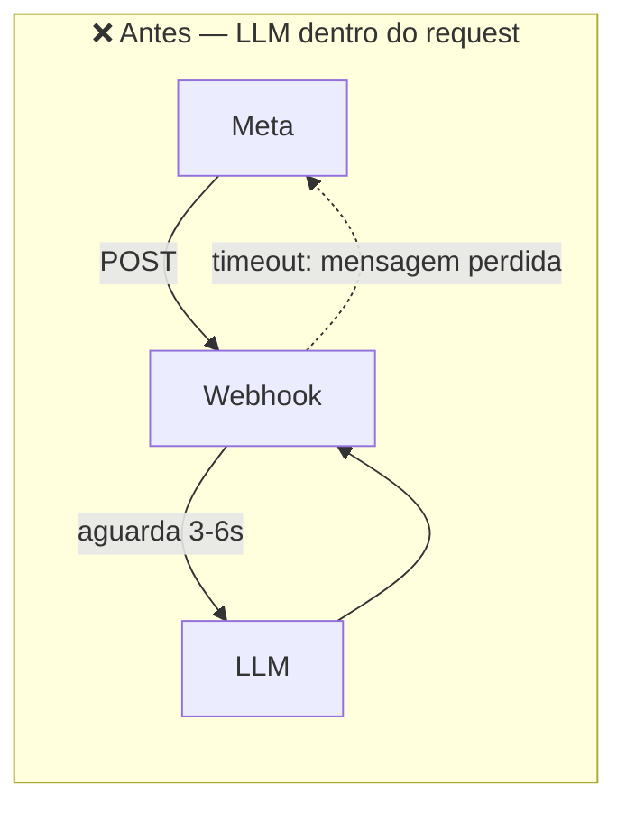
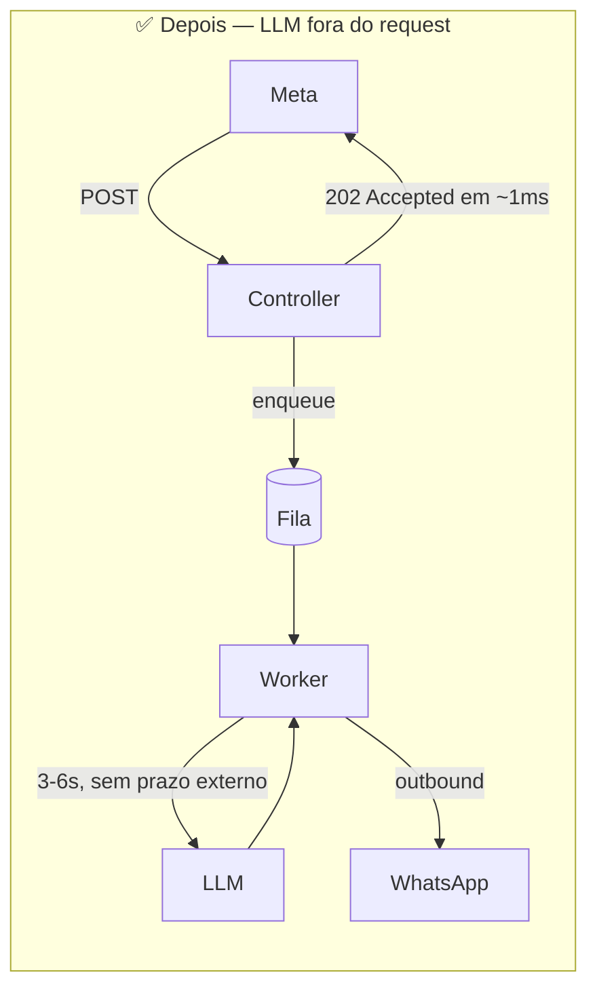

# PoC — Webhook do WhatsApp com recebimento não-bloqueante

Prova de conceito para o incidente de **timeout no webhook do WhatsApp**: o
recebimento passa a ser síncrono e barato, o trabalho caro vai para uma fila, e
a resposta ao usuário sai por uma chamada de saída independente.

```
Receber (sync, ~1ms) ──▶ Processar (async, na fila) ──▶ Responder (outbound)
```

---

## O problema

O webhook consultava o LLM **dentro do request HTTP da Meta**. Quando o LLM
ficou lento, a resposta ultrapassou o limite da plataforma.

O modo de falha é pior do que parece: a Meta trata a ausência de resposta a
tempo como falha de entrega — reenvia o evento e, diante de falhas repetidas,
chega a desabilitar o webhook. A lentidão do LLM não causava só latência,
causava **perda de mensagem**.

A causa raiz não é o LLM ser lento. É o acoplamento entre **receber** e
**processar**: dois trabalhos com requisitos de tempo incompatíveis presos ao
mesmo ciclo de vida. Enquanto estiverem no mesmo request, o mais lento decide.





## Resultado medido

Servidor real, LLM simulado entre 3 e 6 segundos, 13 requisições:

|                      | Latência                               |
| -------------------- | -------------------------------------- |
| **Resposta à Meta**  | min 0ms · média 0ms · **máx 1ms**      |
| Processamento do LLM | min 3441ms · média 4771ms · máx 5856ms |

Rajada de 10 webhooks: **169ms no total** (16ms cada), com a fila absorvendo o
acúmulo (`pending: 8, inFlight: 3`) enquanto a ingestão seguia respondendo.

Sob 60% de falha no LLM e 20% no gateway: **25 de 25 mensagens entregues**, 60
retries, nenhuma perda. Reproduza com `npm test` ou pela seção
[Reproduzindo a medição](#reproduzindo-a-medição).

---

## Setup

**Requisitos:** Node.js ≥ 20.11 (testado no 24). Nenhum banco, nenhum serviço
externo.

```bash
npm install
cp .env.example .env     # opcional: todos os valores têm padrão
npm run dev              # sobe em http://localhost:3000
```

| Comando                      | O que faz                                               |
| ---------------------------- | ------------------------------------------------------- |
| `npm run dev`                | Servidor com hot reload                                 |
| `npm run build && npm start` | Build e execução de produção                            |
| `npm test`                   | Suíte completa (103 testes, ~2s)                        |
| `npm run test:coverage`      | Cobertura com thresholds                                |
| `npm run verify`             | **Portão completo:** typecheck + lint + format + testes |

> `npm test` transpila sem checar tipos. Use `npm run verify` antes de commitar.

## Payload mínimo

O menor payload aceito — apenas os campos que o sistema realmente lê:

```json
{
  "object": "whatsapp_business_account",
  "entry": [
    {
      "changes": [
        {
          "value": {
            "messages": [
              {
                "from": "5521999998888",
                "id": "wamid.ABC123",
                "timestamp": "1768471200",
                "type": "text",
                "text": { "body": "Qual o status do meu processo?" }
              }
            ]
          }
        }
      ]
    }
  ]
}
```

```bash
curl -X POST http://localhost:3000/webhook \
  -H 'Content-Type: application/json' \
  -d '{"object":"whatsapp_business_account","entry":[{"changes":[{"value":{"messages":[
       {"from":"5521999998888","id":"wamid.ABC123","timestamp":"1768471200",
        "type":"text","text":{"body":"Qual o status do meu processo?"}}]}}]}]}'

# → HTTP 202  {"status":"accepted","accepted":1}
```

### Endpoints

| Método | Rota                           | Resposta                                       |
| ------ | ------------------------------ | ---------------------------------------------- |
| `POST` | `/webhook`                     | **202** `{"status":"accepted","accepted":N}`   |
| `POST` | `/webhook` (envelope inválido) | **400**                                        |
| `GET`  | `/health`                      | **200** com estado da fila, da DLQ e do worker |

**Por que 202 e não 200:** a requisição foi _aceita para processamento_, que
ainda não ocorreu. O status descreve com honestidade o que aconteceu — e é o
contrato que autoriza responder antes de ter a resposta do LLM.

**Por que eventos desconhecidos recebem 202 com `accepted: 0`:** a Meta entrega
dezenas de tipos de evento no mesmo endpoint (status de entrega, reações, mídia)
e trata `4xx` como falha de entrega. Um schema rígido faria a plataforma
reenviar eventos legítimos até desabilitar o webhook. Validamos apenas o
envelope; o que não reconhecemos é ignorado em silêncio. `400` fica reservado ao
envelope quebrado — caso em que nenhuma reentrega ajudaria.

---

## Arquitetura

Clean Architecture com a regra de dependência apontando para dentro: quem
**precisa** de uma capacidade define a interface; quem **fornece** se adapta.

```
src/
├── domain/                 Entidades e erros. Zero dependência externa.
│   ├── entities/             IncomingMessage
│   └── errors/               IntegrationError (transitório × permanente)
├── application/            Casos de uso e os ports que eles exigem.
│   ├── ports/                Queue, Logger, LlmProvider, WhatsAppGateway
│   └── use-cases/            EnqueueIncomingMessages, ProcessIncomingMessage
├── infrastructure/         Implementações concretas dos ports.
│   ├── queue/                InMemoryQueue
│   ├── logging/              JsonLogger, pii-masker
│   ├── adapters/             FlakyLlmProvider, SimulatedWhatsAppGateway
│   └── workers/              QueueWorker
├── presentation/           HTTP: rotas, controllers, schema.
└── main/                   Composition root e configuração.
```

O caso de uso nunca importa Fastify nem SDK externo. O único arquivo que conhece
`InMemoryQueue` é `src/main/application.ts` — é isso que torna a troca por um
broker uma mudança de uma linha.

### Divisão de responsabilidades

| Componente                | Responsabilidade                              | O que **não** faz              |
| ------------------------- | --------------------------------------------- | ------------------------------ |
| `WebhookController`       | Extrai mensagens, enfileira, devolve 202      | Não conhece Fastify nem a fila |
| `EnqueueIncomingMessages` | Todo o trabalho síncrono do webhook           | Não processa nada              |
| `InMemoryQueue`           | **Mecanismo:** ack, nack, backoff, DLQ        | Não decide quantas tentativas  |
| `QueueWorker`             | **Política:** tentativas, curva, concorrência | Não sabe o que é uma mensagem  |
| `ProcessIncomingMessage`  | Uma tentativa: LLM → outbound                 | Não conhece retry              |

Fila e worker mudam por motivos diferentes: trocar o broker não deveria obrigar
a rediscutir a política de retry.

### Resiliência

- **Retry com backoff exponencial e jitter.** Sem jitter, todas as mensagens que
  falharam durante uma queda do LLM voltam no mesmo instante e o derrubam de
  novo assim que ele se recupera.
- **Falha permanente não é repetida.** `400` do provedor vai direto para a DLQ,
  sem queimar tentativas.
- **Timeout por tentativa como corrida**, não apenas `AbortSignal`. JavaScript
  não mata uma promise: um handler que ignore o sinal seguraria um slot de
  concorrência para sempre — o timeout da Meta reaparecendo como vazamento de
  capacidade, só que invisível.
- **DLQ preserva a mensagem** para reprocessamento. É o que separa "falhou" de
  "foi perdida".
- **Shutdown gracioso:** encerra o HTTP antes de drenar o worker, para não
  descartar trabalho que a Meta já considera confirmado.

## Segurança: mascaramento de PII

O mascaramento acontece **dentro do logger**, não na chamada. Confiar que todo
autor lembrará de mascarar antes de logar é uma política que falha na primeira
pressa — e falha em silêncio. Aqui não existe caminho até a saída que não passe
pelo mascarador, e a regra `no-console: error` do ESLint impede que alguém o
contorne com um `console.log` de debug esquecido. O logger embutido do Fastify
está desligado pelo mesmo motivo: ele registraria requisições sem passar pelo
mascarador, justamente onde o payload chega.

**Duas camadas:**

- **Por chave** — `phone`, `wa_id`, `profileName`, `from` são mascarados pelo
  _nome do campo_. É a camada principal: nome próprio não tem formato detectável
  por regex, só se sabe que `contactName` contém um nome porque a chave diz.
- **Por padrão** — regex sobre qualquer string, para telefone, e-mail e CPF que
  apareçam em texto livre (uma mensagem de erro de upstream, por exemplo).

Entrada e saída reais:

```jsonc
// entrada
{ "profile": { "name": "João da Silva" }, "wa_id": "5521999998888",
  "text": { "body": "Meu CPF é 123.456.789-01" } }

// no log
{ "profile": { "name": "J*** d*** S***" }, "wa_id": "55*******8888",
  "text": "[redacted]" }
```

**O corpo da mensagem é redigido por inteiro**, não mascarado por padrão. O que
o usuário digita é arbitrário — endereço, nome no meio da frase, dado de saúde —
e regex só pega o que tem formato. Preserva-se apenas o tamanho
(`[redacted:26 chars]`), suficiente para diagnosticar truncamento.

**O que sobrevive:** `wamid`, `phone_number_id`, UUIDs de correlação, latências.
Um log que não permite correlacionar não serve para nada — mascarar tudo é tão
inútil quanto não mascarar nada.

## Testes

**103 testes, ~2 segundos, sem infraestrutura.** Cobertura em 97,7% de
statements, com thresholds como piso contra regressão silenciosa.

O teste que sustenta a PoC:

```typescript
it('responde de imediato mesmo com o LLM travado — a tese da PoC', async () => {
  const stuckLlm = { complete: () => new Promise(() => undefined) }; // nunca resolve
  // ...
  expect(response.statusCode).toBe(202);
  expect(Date.now() - startedAt).toBeLessThan(500);
});
```

Cobertura das falhas do LLM:

| Cenário              | Comportamento verificado           |
| -------------------- | ---------------------------------- |
| Falha intermitente   | Retry até suceder, **0 na DLQ**    |
| Falha permanente     | DLQ direto, **1 tentativa só**     |
| Tentativas esgotadas | DLQ com a mensagem **recuperável** |
| Handler travado      | Timeout libera o slot e reagenda   |
| Backoff              | Sequência exata 100/200/400ms      |
| Jitter               | 1000ms → 500ms no piso             |
| LLM fora do ar       | Ingestão segue aceitando em 202    |

`random` e `sleep` são injetáveis nos adapters: um mock aleatório com timer real
produz teste instável, que é o pior tipo — ensina o time a ignorar falhas de CI.

## Configuração

Todas as variáveis têm padrão; veja `.env.example`. Valor inválido **derruba o
processo no boot**, de propósito: melhor falhar no deploy, quando ainda dá para
reverter, do que horas depois no meio do processamento.

| Variável                     | Padrão             | Descrição                                |
| ---------------------------- | ------------------ | ---------------------------------------- |
| `PORT` / `HOST`              | `3000` / `0.0.0.0` | Endereço do servidor                     |
| `LOG_LEVEL`                  | `info`             | `debug` \| `info` \| `warn` \| `error`   |
| `QUEUE_CONCURRENCY`          | `2`                | Mensagens processadas em paralelo        |
| `QUEUE_MAX_ATTEMPTS`         | `3`                | Tentativas antes da DLQ                  |
| `QUEUE_RETRY_BASE_DELAY_MS`  | `250`              | Base do backoff exponencial              |
| `QUEUE_HANDLER_TIMEOUT_MS`   | `15000`            | Prazo de uma tentativa                   |
| `LLM_MIN_LATENCY_MS` / `MAX` | `500` / `4000`     | Latência simulada do LLM                 |
| `LLM_FAILURE_RATE`           | `0.3`              | Probabilidade de falha transitória (0–1) |

## Reproduzindo a medição

```bash
# LLM lento e instável, como no incidente
LLM_MIN_LATENCY_MS=3000 LLM_MAX_LATENCY_MS=6000 LLM_FAILURE_RATE=0.4 npm run dev
```

```bash
# tempo de resposta ao webhook, com o LLM levando 3-6s
curl -s -o /dev/null -w 'HTTP %{http_code} em %{time_total}s\n' \
  -X POST http://localhost:3000/webhook -H 'Content-Type: application/json' \
  -d '{"object":"whatsapp_business_account","entry":[{"changes":[{"value":{"messages":[
       {"from":"5521999998888","id":"wamid.1","timestamp":"1768471200",
        "type":"text","text":{"body":"teste"}}]}}]}]}'

# a fila absorvendo o acúmulo
curl -s http://localhost:3000/health
```

Os logs em stdout mostram `webhook accepted` com `durationMs` próximo de zero e,
segundos depois, `reply delivered` com `totalDurationMs` na casa dos milhares —
o desacoplamento visível em duas linhas.

---

## Decisões de arquitetura (ADR)

📄 **[ADR 0001 — Fila em memória na PoC, message broker em produção](docs/adr/0001-fila-em-memoria-na-poc.md)**

Resumo: a tese a provar era o **desacoplamento**, não a durabilidade. Um broker
real responderia a mesma pergunta acrescentando infraestrutura, credenciais e
latência ao ciclo — e tornaria a reprodução dependente de setup externo e os
testes lentos e intermitentes.

A fila em memória fica atrás de um port cujo vocabulário (`enqueue`, `dequeue`,
`ack`, `nack`, backoff, dead-letter) espelha o de um broker real, e o contrato é
assíncrono mesmo sendo síncrono em memória — justamente para que a troca não
quebre assinatura alguma.

**Recomendação para produção: Amazon SQS com redrive policy.** O motivo é
específico: o modelo do SQS — _visibility timeout_, `DeleteMessage`,
`maxReceiveCount`, DLQ como fila de primeira classe — é exatamente o que o port
já expressa. `dequeue` → `ReceiveMessage`, `ack` → `DeleteMessage`, `nack` →
`ChangeMessageVisibility`. A migração é escrever `SqsQueue implements Queue<T>` e
trocar uma linha em `src/main/application.ts`.

O ADR detalha a comparação com BullMQ, RabbitMQ e Kafka, e as estratégias
completas de **Retry** (classificação, jitter, visibility timeout, idempotência
por `wamid`) e **DLQ** (redrive, alarme, contexto da falha, idade da mensagem
mais antiga).

## Limitações conhecidas

Escopo consciente de PoC — cada item está detalhado no ADR:

- **Fila em memória:** restart ou `SIGKILL` perde mensagens pendentes e em voo.
  O shutdown gracioso reduz o risco, mas não o elimina.
- **Sem escala horizontal:** duas instâncias teriam filas independentes.
- **Sem deduplicação por `wamid`:** a reentrega da Meta gera processamento
  repetido. O ponto de extensão está em `EnqueueIncomingMessages`.
- **Sem validação da assinatura** `X-Hub-Signature-256` nem o handshake
  `GET /webhook` com `hub.challenge`.
- **LLM e WhatsApp são mocks:** latência e falhas simuladas, sem chamada real.
- **Nota operacional:** sob `npm run dev`, o wrapper do `tsx` não propaga
  `SIGTERM` ao processo filho. Para verificar o shutdown gracioso, use
  `npm run build && npm start`.
